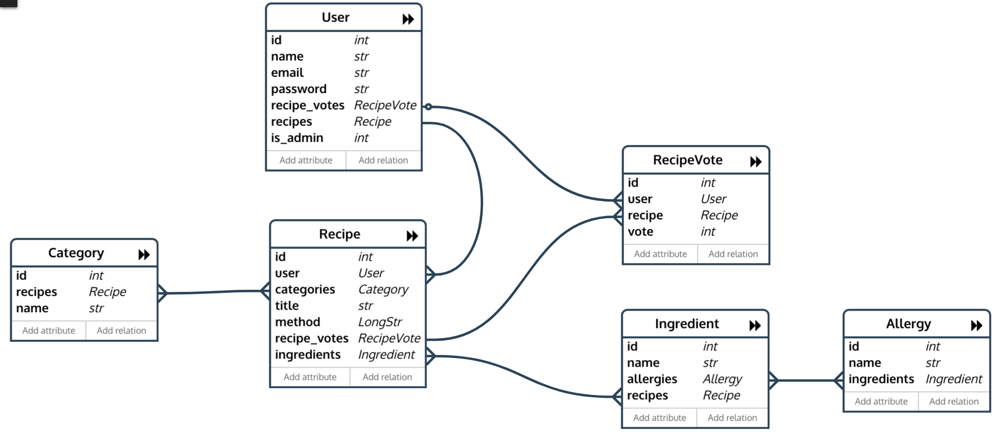

# Cookbook

This is the Data Centric Unit Milestone Project, for Code Institute's Full Stack Web Developer Course.
The objective of this project is to create a web application in which users can easily **store and retrieve cooking recipes**. 
This is constructed on a relational Database, applying the backend coding language Python, and the Flask microframework to create the frontend.

## UX

This website is designed for anyone who enjoys cooking and wishes to have access to a great variety of recipes in only one place with a clear and easy interphase. 

The user of this web application will perform two sets of actions depending on whether or not the user is an Admin. A regular user can only search, read and vote in the recipes, while a user with Administration permissions can Edit and Delete all recipes, ingredients, categories and allergies.

Recipes can be read, searched for, downvoted or upvoted. They are classified in Categories such as Breakfast, Dessert or Vegan and have an Allergy indicator to ensure safety.

The following wireframe was designed to represent the website skeletal framework.

 

Prior to the web application creation, a Relational Database was mapped with the PonyORM tools (https://editor.ponyorm.com). The resulting diagram below represents the different tables and relationships between them.

A non Admin user will Create a User, Login to their account and Search for recipes.   
This user can enter a keyword, choose an ingredient or a category of meal and search the existing recipes. The result is displayed and organized through Flask Pagination. 
The user can click on the recipe title and read the recipe.

## Features

### Existing Features
- User creation and login, which allows users to vote
- Recipe Search
- Voting system
- Non admin user can Read
- Admin can Create, Edit and Delete
- Admin can associate an Allergy to an Ingredient

## Technologies Used
- HTML language, to write the web page layout. 

- CSS and Sass language to style the application.

- Yarn, JavaScript package manager (https://yarnpkg.com/lang/en/).

- Font Awesome (https://fontawesome.com/)
    Font and Icon toolkit

- Font Google (https://fonts.google.com/)
    Font toolkit.

- Bootstrap 4 (https://getbootstrap.com/docs/4.0/getting-started/introduction/)
    Framework used to uniform the layout. Also, the spacing utils section has been creaated from the information in https://getbootstrap.com/docs/4.1/utilities/spacing/.
    
- Media Queries were used to control the responsive adjustments for smallest screens of the subtitles and paragraphs.

- Slate Bootstwatch was used as a Theme (https://bootswatch.com/3/slate).

- Python, backend language, to create the server of the game application.

- Flask, microframework for the frontend aspect of the application.

- Flask paginate, for pagination implementation.

- PonyORM, Python Object-Relational Mapper.  

- Heroku, for deployment.
    
- Sqlite3 database engine (https://www.sqlite.org/index.html). This was used for development.

- Postgres (https://www.postgresql.org), database engine used for the deployed version on Heroku.

- TravisCI (https://travis-ci.org/), for automated testing prior to development.

- GitKraken (https://support.gitkraken.com/), for management of Branch and Git commits.

- WTF Form Validators (http://wtforms.simplecodes.com/docs/0.6/validators.html), verifying the form input fulfills some criterion.

- Sentry (https://sentry.io/welcome/), platform for monitoring exceptions.

- Select2, (https://select2.org/), jQuery replacement for select boxes.

- Faker (https://faker.readthedocs.io/en/master/), to populate a mock database for testing.

- Python PEP8 checker (http://pep8online.com/)

## Testing

Testing was performed through automated and manual tests. 

Python code is PEP8 compliant, checked through http://pep8online.com/

Unit tests were performed on the different Repositories. 
The actions of Create, Read, Update and Delete were tested on each Repository using a test seeder mock database, 
created by Faker.
After this, the repositories were refactored around the actions of create, edit, read and delete. Test driven 
development was carried out in this section.

Travis CI integration was configured to perform automatic tests -using testunit.py- before deployment.

This application was extensively tested in different browsers, 
screen sizes and Operative Systems, since it was originally designed in a Mac Desktop.

Manual Browser testing was performed through acting like a user in the web page, 
utilizing all the features.

An example of a manual browser test was User creation.

A. User Creation:
  1. In home, go to Register
  2. Submit a user name, longer than three characters
  3. Submit an email address, must be valid
  4. Submit a password and confirm it
  5. See a welcome message in the Navbar
  6. Be allowed to vote a recipe
  7. Logout with link in Navbar

Create, Read, Update and Delete methods were tested manually in Recipes, Allergies, Ingredients and Categories. 

## Deployment

This project was deployed through Heroku, it can be found here: http://winnerwinnerchickendinner.herokuapp.com/
(This name was chosen because Heroku app names have to be unique)

Heroku allows automatic deployment from a chosen branch.
Travis CI integration was configured to perform automatic tests before every deployment.
Exceptions were handled with Sentry platform.

In this case, the deployed branch is the master branch. 

Development was done in the development branch managed through GitKraken.

Postgresql Database is used in the deployed version instead of SQLite, which was used for development. SQLite is not 
suitable for Heroku because Heroku deploys a managed container system and will therefore erase any added or edited 
information in the live version with each deployment.

Use the following credentials in order to test Admin function:
email: tylermeyer@burgess.org
password: d123qwe

For environment variables in development .env was used. For deployment, the variables were manually set.

## Credits

Recipes sourced from:
- https://www.bbcgoodfood.com/recipes/
- https://itdoesnttastelikechicken.com
- https://www.delish.com

### Media
- The logo image was made by me.

